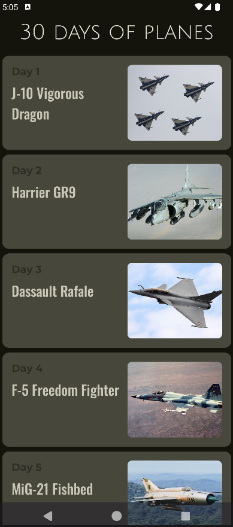
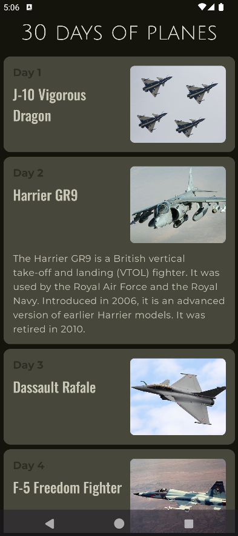

# Plane of the Day - Android App

## Overview
**Plane of the Day** is an Android application developed using Kotlin and Jetpack Compose. The app features a new plane for each day, showcasing an image and detailed description. Users can tap on a plane's card to expand it, revealing more detailed information with a smooth animation. This dynamic feature allows users to interactively discover interesting details about each plane. The app is perfect for aviation enthusiasts or anyone interested in learning more about different planes in an easy and visually appealing way.

---

## Features
- Display a different plane every day with a picture and detailed description.
- Minimalistic and intuitive user interface built using Jetpack Compose.
- Easy navigation between different planes for each day.
- Expandable information cards for a more detailed view of the plane's specifications.

---

## Screenshots
### Main Screen


### Plane Details


---

## Installation

### Prerequisites
- Android Studio (Arctic Fox or newer)
- Kotlin 1.5+
- Gradle 7.0+

### Steps to run the app:
1. Clone the repository:
   ```bash
   git clone https://github.com/MateuszK2k3/30DaysApp.git
